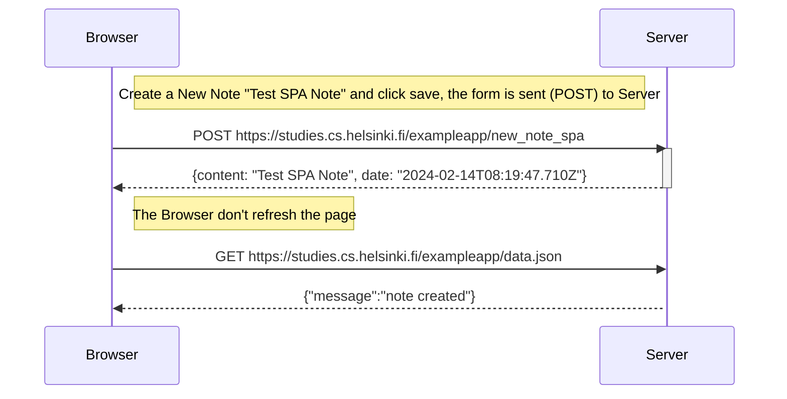

```mermaid
sequenceDiagram
     Note right of Browser: Create a New Note "Test SPA Note" and click save, the form is sent (POST) to Server
    Browser->>Server: POST https://studies.cs.helsinki.fi/exampleapp/new_note_spa
    activate Server

    Server-->>Browser: {content: "Test SPA Note", date: "2024-02-14T08:19:47.710Z"}
    deactivate Server
     Note right of Browser: The Browser don't refresh the page
         Browser->>Server: GET https://studies.cs.helsinki.fi/exampleapp/data.json
    activate Server
    Server-->>Browser: {"message":"note created"}
```